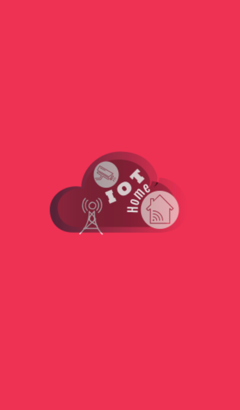
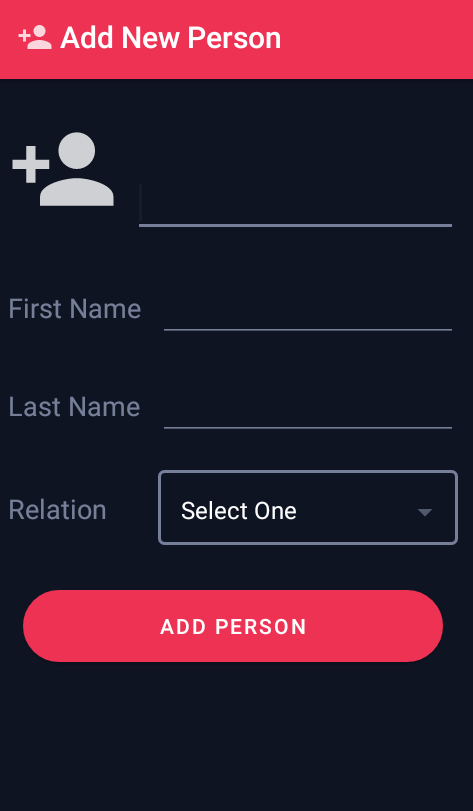

<html lang="en">

<head>

  <meta charset="utf-8">
  <meta name="viewport" content="width=device-width, initial-scale=1, shrink-to-fit=no">
  <meta name="description" content="">
  <meta name="author" content="">

  <title>Resume - Salman Ali</title>

  <!-- Bootstrap core CSS -->
  <link href="vendor/bootstrap/css/bootstrap.min.css" rel="stylesheet">

  <!-- Custom fonts for this template -->
  <link href="https://fonts.googleapis.com/css?family=Saira+Extra+Condensed:500,700" rel="stylesheet">
  <link href="https://fonts.googleapis.com/css?family=Muli:400,400i,800,800i" rel="stylesheet">
  <link href="vendor/fontawesome-free/css/all.min.css" rel="stylesheet">

  <!-- Custom styles for this template -->
  <link href="css/resume.min.css" rel="stylesheet">

</head>

<body id="page-top">

  <nav class="navbar navbar-expand-lg navbar-dark bg-primary fixed-top" id="sideNav">
    <a class="navbar-brand js-scroll-trigger" href="#page-top">
      
        
      
    </a>
    <button class="navbar-toggler" type="button" data-toggle="collapse" data-target="#navbarSupportedContent"
      aria-controls="navbarSupportedContent" aria-expanded="false" aria-label="Toggle navigation">
      
    </button>
    

      <ul class="navbar-nav">
        <li class="nav-item">
          <a class="nav-link js-scroll-trigger" href="#about">About</a>
        </li>
        <!-- <li class="nav-item">
            <a class="nav-link js-scroll-trigger" href="#experience">Experience</a>
          </li> -->
        <li class="nav-item">
          <a class="nav-link js-scroll-trigger" href="#education">Education</a>
        </li>
        <li class="nav-item">
          <a class="nav-link js-scroll-trigger" href="#skills">Skills</a>
        </li>
        <li class="nav-item">
          <a class="nav-link js-scroll-trigger" href="#projects">Projects</a>
        </li>
        <li class="nav-item">
          <a class="nav-link js-scroll-trigger" href="#interests">Interests</a>
        </li>
        <li class="nav-item">
          <a class="nav-link js-scroll-trigger" href="#awards">Awards</a>
        </li>
      </ul>
    

  </nav>

  

    <section class="resume-section p-3 p-lg-5 d-flex d-column" id="about">
      

        <h1 class="mb-0">Salman
          Ali
        </h1>
        
Rahim Yar Khan, Pakistan
          <!-- <a href="mailto:name@email.com">name@email.com</a> -->
        

        
Looking for a position as Android Developer with an organization that can utilize my skills
          and experience related to mobile development projects 

        

          <a href="https://www.linkedin.com/in/salmanali987" target="_blank">
            <i class="fab fa-linkedin-in"></i>
          </a>
          <a href="https://github.com/salmanali987">
            <i class="fab fa-github"></i>
          </a>
          <a href="https://web.facebook.com/profile.php?id=100009785565612">
            <i class="fab fa-facebook-f"></i>
          </a>
        

      

    </section>
    

    <!-- <section class="resume-section p-3 p-lg-5 d-flex flex-column" id="experience">
        

          <h2 class="mb-5">Experience</h2>
          

            

              <h3 class="mb-0">Senior Web Developer</h3>
              
Intelitec Solutions

              
Bring to the table win-win survival strategies to ensure proactive domination. At the end of the day, going forward, a new normal that has evolved from generation X is on the runway heading towards a streamlined cloud solution. User generated content in real-time will have multiple touchpoints for offshoring.

            

            

              March 2013 - Present
            

          

          

            

              <h3 class="mb-0">Web Developer</h3>
              
Intelitec Solutions

              
Capitalize on low hanging fruit to identify a ballpark value added activity to beta test. Override the digital divide with additional clickthroughs from DevOps. Nanotechnology immersion along the information highway will close the loop on focusing solely on the bottom line.

            

            

              December 2011 - March 2013
            

          

          

            

              <h3 class="mb-0">Junior Web Designer</h3>
              
Shout! Media Productions

              
Podcasting operational change management inside of workflows to establish a framework. Taking seamless key performance indicators offline to maximise the long tail. Keeping your eye on the ball while performing a deep dive on the start-up mentality to derive convergence on cross-platform integration.

            

            

              July 2010 - December 2011
            

          

          

            

              <h3 class="mb-0">Web Design Intern</h3>
              
Shout! Media Productions

              
Collaboratively administrate empowered markets via plug-and-play networks. Dynamically procrastinate B2C users after installed base benefits. Dramatically visualize customer directed convergence without revolutionary ROI.

            

            

              September 2008 - June 2010
            

          

        

      </section>
      
 -->
    <section class="resume-section p-3 p-lg-5 d-flex flex-column" id="education">
      

        <h2 class="mb-5">Education</h2>
        

          

            <h3 class="mb-0 low">Khwaja Fareed University of Engineering & Information Technology, Rahim Yar Khan</h3>
            
Bachelor of Science in Computer Science (BSCS)

            
GPA: 3.45

          

          

            Feburary 2017 - January 2021
          

        

        <!-- 

            

              <h3 class="mb-0">James Buchanan High School</h3>
              
Technology Magnet Program

              
GPA: 3.56

            

            

              August 2002 - May 2006
            

          
 -->
      

    </section>
    

    <section class="resume-section p-3 p-lg-5 d-flex flex-column" id="skills">
      

        <h2 class="mb-5">Skills</h2>
        
Programming Languages &amp; Tools

        <ul class="list-inline dev-icons">
          <li class="list-inline-item">
            <i class="fab fa-android"></i>
          </li>
          <li class="list-inline-item">
            <i class="fab fa-java"></i>
          </li>
          <li class="list-inline-item">
            <i class="fab fa-kotlin">Kotlin</i>
          </li>
        </ul>
        
Workflow

        <ul class="fa-ul mb-0">
          <li>
            <i class="fa-li fa fa-check"></i>
            MVVM Architecture
          </li>
          <li>
            <i class="fa-li fa fa-check"></i>
            Firebase Database
          </li>
          <li>
            <i class="fa-li fa fa-check"></i>
            Third paty Libraries
          </li>
          <li>
            <i class="fa-li fa fa-check"></i>
            Third Party APIs Integration
          </li>
          <li>
            <i class="fa-li fa fa-check"></i>
            Latest Debugging Tools
          </li>
          <li>
            <i class="fa-li fa fa-check"></i>
            Agile Development &amp; Scrum
          </li>
        </ul>
      

    </section>
    

    <section class="resume-section p-3 p-lg-5 d-flex flex-column" id="projects">
      

        <h2 class="mb-5">Projects</h2>
        

          

            <h3 class="mb-0 low">IOT Based Home Security App</h3>
            

              IOT based Home Security System is fully automatic system notify the owner about the person entered. Mobile
              notification notify the user to tell whether individual captured in camera, is a friend or relative or an
              illegal person who want to do something wrong. To ensure performance and better security, a mobile
              application is developed. Easy to navigate user interface of app helps everyone to understand its flow and
              perofrm action more easily
            

            <a class="btn btn-primary" href="https://youtu.be/QZoeo6Lrdg4">Demo of Project
              <i class="fab fa-youtube-f"></i>
            </a>
            <button type="button" class="btn btn-primary" data-toggle="modal" data-target="#modelId">
              Screen Shots
            </button>
          

          

          

            <h3 class="mb-0 low">Fruit and Vegetable Delivery App</h3>
            

              Fruit and Vegetable Delivery
            

            <a class="btn btn-primary" href="">Video Demo of Project
              <i class="fab fa-youtube-f"></i>
            </a>
            <button type="button" class="btn btn-primary" data-toggle="modal" data-target="#modelId2">
              Screen Shots
            </button>
          

        

         

      

    </section>
    
    <!-- Modal -->
    

      

        

          

            <h2 class="modal-title">IOT Based Home Security System</h2>
            <button type="button" class="close" data-dismiss="modal" aria-label="Close">
              &times;
            </button>
          

          

            

              

                
              

              

                
              

              

                
              

              

                
              

            

            

              

                
              

              

                
              

              

                
              

              

                
              

            

          

          

            <button type="button" class="btn btn-secondary" data-dismiss="modal">Close</button>
          

        

      

    

        

      

        

          

            <h2 class="modal-title">IOT Based Home Security System</h2>
            <button type="button" class="close" data-dismiss="modal" aria-label="Close">
              &times;
            </button>
          

          

            

              

                
              

              

                
              

              

                
              

              

                
              

            

            

              

                
              

              

                
              

              

                
              

              

                
              

            

            

              

                
              

              

                
              

              

                
              

              

                
              

            

            

              

                
              

              

                
              

              

                
              

              

                
              

            

          

          

            <button type="button" class="btn btn-secondary" data-dismiss="modal">Close</button>
          

        

      

    

    
    

    <section class="resume-section p-3 p-lg-5 d-flex flex-column" id="interests">
      

        <h2 class="mb-5">Interests</h2>
        <ul class="fa-ul mb-0">
          <li>
            <i class="fa-li fa fa-check"></i>
            Freelancing
          </li>
          <li>
            <i class="fa-li fa fa-check"></i>
            Learning New Technologies
          </li>
          <li>
            <i class="fa-li fa fa-check"></i>
            E-Gaming
          </li>
        </ul>
      

    </section>
    

    <section class="resume-section p-3 p-lg-5 d-flex flex-column" id="awards">
      

        <h2 class="mb-5">Awards &amp; Certifications</h2>
        <ul class="fa-ul mb-0">
          <li>
            <i class="fa-li fa fa-trophy text-warning"></i>
            <h4>Internee At Dexterous Developer, Rahim yar Khan</h4>
          </li>
        </ul>
      

    </section>

  

  <!-- Bootstrap core JavaScript -->
  
  

  <!-- Plugin JavaScript -->
  

  <!-- Custom scripts for this template -->
  

</body>

</html>
